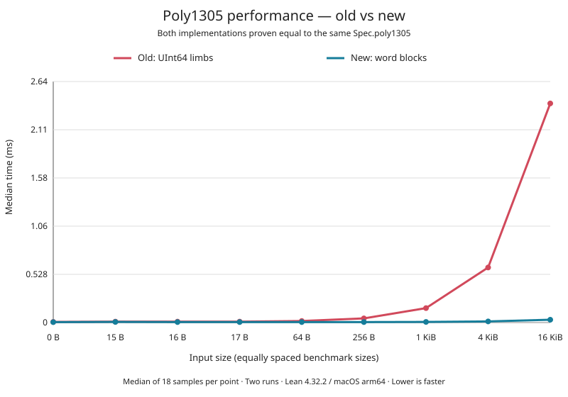
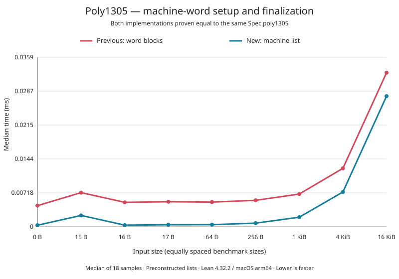
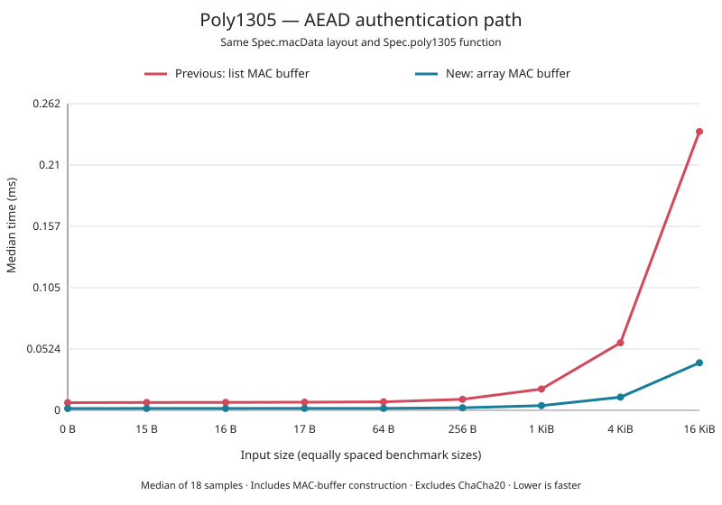

# ChaCha20 performance comparison

`ChaCha20.lean` is a revision-neutral native benchmark. It warms each input
size twice, calibrates samples toward 30 ms, and records nine trials. The timed
result is forced through an `IO.Ref` before the ending clock read.

`ChaCha20Original.lean` is the same harness with its import redirected to the
archived implementation. This allows both versions to remain benchmarkable
after the current implementation is committed.

`ChaCha20Precomputed.lean` targets the archived block-precomputation baseline
immediately before the raw-array round-loop optimization.

`ChaCha20RawRounds.lean` targets the archived raw-round-loop baseline
immediately before proof-bounded keystream table access.

The CSV data compares commit `1db9807` (`original`) with the working-tree
implementation (`current`). Both revisions successfully built their own
`Correctness.lean` and RFC tests against the unchanged `Spec.lean`. Checksums
agree for every measured input size.

```bash
export PATH="$HOME/.elan/bin:$PATH"
lake build Crypto.Stream.ChaCha20.Correctness Crypto.Stream.ChaCha20.Tests chacha20_bench
.lake/build/bin/chacha20_bench VERSION_LABEL
lake build Crypto.Stream.ChaCha20.Archive.OriginalCorrectness chacha20_bench_original
.lake/build/bin/chacha20_bench_original original
lake build Crypto.Stream.ChaCha20.Archive.PrecomputedCorrectness chacha20_bench_precomputed
.lake/build/bin/chacha20_bench_precomputed precomputed
lake build Crypto.Stream.ChaCha20.Archive.RawRoundsCorrectness chacha20_bench_raw_rounds
.lake/build/bin/chacha20_bench_raw_rounds raw-rounds
python3 Bench/plot_results.py Bench/chacha20-original.csv Bench/chacha20-precomputed.csv \
  Bench/01-original-vs-precomputed.svg
python3 Bench/plot_results.py Bench/chacha20-precomputed.csv Bench/chacha20-raw-rounds.csv \
  Bench/02-precomputed-vs-raw-rounds.svg
python3 Bench/plot_results.py Bench/chacha20-raw-rounds-baseline.csv Bench/chacha20-bounded-access.csv \
  Bench/03-raw-rounds-vs-bounded-access.svg
```

For publication-quality measurements, close CPU-intensive applications,
connect AC power, and repeat the complete experiment several times.

## Poly1305 full-width versus UInt64 limbs

`Poly1305.lean` compares the archived full-width-`Nat` implementation, the
five-limb `UInt64` baseline (`Fast.poly1305`), the first word-block optimization
(`WordBlocks.poly1305`), and the current machine-word list and array APIs in one
native executable.
It checks tag equality at every size before timing, calibrates each version
independently toward 40 ms (capped at 16,384 iterations), warms it twice, and
emits nine CSV trials. Trials interleave the versions and reverse their order
on alternate trials.
Each timed call feeds its tag into a rolling checksum stored through an
`IO.Ref` before the ending clock read.

```bash
export PATH="$HOME/.elan/bin:$PATH"
lake build Crypto.AEAD.ChaCha20Poly1305.Tests poly1305_bench
.lake/build/bin/poly1305_bench > Bench/poly1305-word-blocks.csv
.lake/build/bin/poly1305_bench > Bench/poly1305-word-blocks-repeat.csv
```

The word-block baseline decodes each full 16-byte block directly into machine-word
limbs, avoiding large-`Nat` block construction and temporary chunk lists. It
retains the previous multiplication and carry operations. Tag serialization
uses two `UInt64` words and byte shifts. Key decoding/clamping, the final
partial block (at most 15 bytes), and final modular reduction/addition still
use `Nat`. This change does not establish constant-time execution or activate
the unproved array decoder and `Fast.finish` path.

`WordBlocksCorrectness.lean` proves exact equality with `Fast.blocksList` for
every key, message, and initial limb state, then derives equivalence with the
unchanged specification. The public `poly1305_correct`, `seal_correct`,
`open_correct`, and `open_seal` statements are unchanged. Their axiom audit
reports only Lean's standard `propext`, `Classical.choice`, and `Quot.sound`.
The AEAD test module also checks zero, all-one, and patterned messages at every
length from 0 through 257, arbitrary key-list lengths at selected boundaries,
and tag serialization boundaries. Failed checks now throw an error.

### Measured word-block improvement



The graph compares the previous active `Fast.poly1305` with
`WordBlocks.poly1305`. Both refinement theorems target the very same
`Crypto.ChaCha20Poly1305.Spec.poly1305` definition in
`Crypto/AEAD/ChaCha20Poly1305/Spec.lean`; no alternate specification is used.
The vertical axis is linear time in milliseconds (lower is faster), and the
horizontal axis lists equally spaced benchmark sizes, matching the earlier graphs.

Regenerate it from the two saved benchmark runs:

```bash
python3 Bench/plot_results.py \
  Bench/poly1305-word-blocks.csv Bench/poly1305-word-blocks-repeat.csv \
  Bench/04-poly1305-uint64-vs-word-blocks.svg \
  --versions uint64_limbs word_blocks \
  --labels 'Old: UInt64 limbs' 'New: word blocks' \
  --title 'Poly1305 performance — old vs new' \
  --subtitle 'Both implementations proven equal to the same Spec.poly1305' \
  --footer 'Median of 18 samples per point · Two runs · Lean 4.32.2 / macOS arm64 · Lower is faster'
```

The two checked-in CSV files each contain nine samples per version and size,
measured locally on macOS arm64 using Lean 4.32.2. The table combines both runs
(18 samples per cell) and reports median microseconds per call. Speedup is
relative to the previous active `UInt64` implementation, not the archived
full-width-`Nat` implementation.

| Message bytes | Previous UInt64 (µs) | Word blocks (µs) | Speedup |
|---:|---:|---:|---:|
| 0 | 7.097 | 4.387 | 1.62× |
| 15 | 9.910 | 7.176 | 1.38× |
| 16 | 10.078 | 5.062 | 1.99× |
| 17 | 10.336 | 5.202 | 1.99× |
| 64 | 17.387 | 5.178 | 3.36× |
| 256 | 45.582 | 5.448 | 8.37× |
| 1024 | 158.245 | 6.745 | 23.46× |
| 4096 | 603.229 | 12.173 | 49.56× |
| 16384 | 2399.880 | 31.305 | 76.66× |

These are standalone Poly1305 measurements over preconstructed lists, including
key setup, finalization, tag allocation, and checksum overhead. They exclude
message-list construction and AEAD composition, use one deterministic key and
message pattern, and are not a comparison against production C libraries.
Machine load and compiler behavior can affect the results; repeat the commands
above when evaluating further changes. The generated benchmark C was checked
to retain the Poly1305 call inside the timed loop.

## Machine-word setup, finalization, and array processing

The current public list API delegates to `Machine.poly1305`; the new
`poly1305Array` API delegates to `Machine.poly1305Array`. AEAD uses the array
API and constructs its padded AAD/ciphertext/length buffer directly in arrays.
It still allocates a combined MAC buffer; this is not a streaming API.

`Machine.lean` removes large-`Nat` arithmetic from key setup and finalization.
Key words are loaded with zero extension and clamped directly into radix-2^26
limbs. Finalization propagates carries, computes the small modulus correction,
adds the pad in radix 2^32, and serializes the resulting machine words. Full
message blocks retain the previous verified multiplication and carries. Only
the final short block, at most 15 bytes, uses the reference `Nat` decoder.
Message indices and lengths also remain `Nat`. Constant-time execution is not
claimed.

`MachineCorrectness.lean` proves the list API agrees with the same
`Spec.poly1305` for every message and key-list length, and proves the arithmetic
and finalization bounds. `MachineArrayCorrectness.lean` proves array processing
equals the reference block loop and derives the same specification theorem for
the array API. `encodeMacDataArray_correct` establishes the byte-for-byte MAC
layout, and `authenticate_correct` connects the new AEAD path to the existing
list contract. The specification and existing public theorem statements remain
unchanged. Axiom audits report only `propext`, `Classical.choice`, and
`Quot.sound`.

The regression suite checks both APIs against the specification at all lengths
0–257 with three data patterns; key lengths 0, 1, 15, 16, 17, 31, 32, 33, and
64; accumulator values around the prime and large carry states; and 81 AAD /
plaintext boundary pairs. RFC vectors, rejection, and roundtrip checks also
pass. All these runtime checks fail the build on a mismatch.

### Standalone results



The following medians combine `poly1305-machine.csv` and
`poly1305-machine-repeat.csv` (18 samples per point, microseconds per call).
The previous column is the already optimized `WordBlocks` baseline, not the
original implementation. Lists and arrays contain identical bytes and are
prepared before timing. The array API also receives a prepared key array;
the list APIs include their key-list conversion/setup costs. These are API
comparisons, not claims about array-construction speed.

| Message bytes | Previous word blocks (µs) | Machine list (µs) | Machine array (µs) |
|---:|---:|---:|---:|
| 0 | 4.457 | 0.301 | 0.195 |
| 15 | 7.215 | 2.383 | 2.399 |
| 16 | 5.159 | 0.332 | 0.212 |
| 17 | 5.285 | 0.415 | 0.304 |
| 64 | 5.215 | 0.428 | 0.254 |
| 256 | 5.582 | 0.746 | 0.417 |
| 1024 | 6.911 | 2.005 | 1.047 |
| 4096 | 12.355 | 7.341 | 3.558 |
| 16384 | 32.615 | 27.644 | 13.813 |

The remaining reference decoder explains why a 15-byte message costs more than
a 16-byte message. Setup/finalization improvements dominate the short-message
results; the array loop adds a larger benefit for long messages.

### AEAD authentication path



`poly1305_bench auth` compares the previous list MAC-buffer construction plus
`WordBlocks.poly1305` with the current `authenticate` function. Both receive
the same preconstructed ciphertext array, 12-byte AAD, and one-time key list.
Timing includes MAC-buffer allocation, encoding, key setup, Poly1305, and tag
serialization; it excludes ChaCha20 encryption and one-time-key derivation.
Tag equality is checked before timing. The combined medians from
`poly1305-auth.csv` and `poly1305-auth-repeat.csv` are:

| Ciphertext bytes | Previous (µs) | Current (µs) | Speedup |
|---:|---:|---:|---:|
| 0 | 6.531 | 1.558 | 4.19× |
| 16 | 6.790 | 1.626 | 4.17× |
| 64 | 7.276 | 1.696 | 4.29× |
| 1024 | 18.203 | 3.999 | 4.55× |
| 16384 | 238.400 | 40.666 | 5.86× |

These measurements were taken locally with Lean 4.32.2 on macOS arm64, using
the same calibration and interleaving method as above. They are not end-to-end
AEAD encryption speedups or comparisons with production C implementations.

```bash
lake build Crypto.AEAD.ChaCha20Poly1305.Tests crypto poly1305_bench
.lake/build/bin/poly1305_bench > Bench/poly1305-machine.csv
.lake/build/bin/poly1305_bench > Bench/poly1305-machine-repeat.csv
.lake/build/bin/poly1305_bench auth > Bench/poly1305-auth.csv
.lake/build/bin/poly1305_bench auth > Bench/poly1305-auth-repeat.csv
python3 Bench/plot_results.py Bench/poly1305-machine.csv Bench/poly1305-machine-repeat.csv \
  Bench/05-poly1305-word-blocks-vs-machine-list.svg \
  --versions word_blocks machine_list --labels 'Previous: word blocks' 'New: machine list' \
  --title 'Poly1305 — machine-word setup and finalization' \
  --subtitle 'Both implementations proven equal to the same Spec.poly1305' \
  --footer 'Median of 18 samples · Preconstructed lists · Lean 4.32.2 / macOS arm64 · Lower is faster'
python3 Bench/plot_results.py Bench/poly1305-auth.csv Bench/poly1305-auth-repeat.csv \
  Bench/06-poly1305-auth-word-vs-machine.svg \
  --versions word_auth machine_auth --labels 'Previous: list MAC buffer' 'New: array MAC buffer' \
  --title 'Poly1305 — AEAD authentication path' \
  --subtitle 'Same Spec.macData layout and Spec.poly1305 function' \
  --footer 'Median of 18 samples · Includes MAC-buffer construction · Excludes ChaCha20 · Lower is faster'
```
